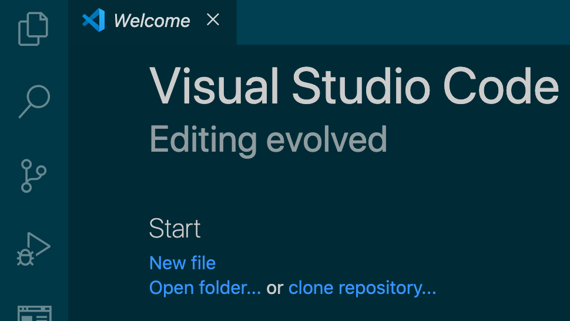
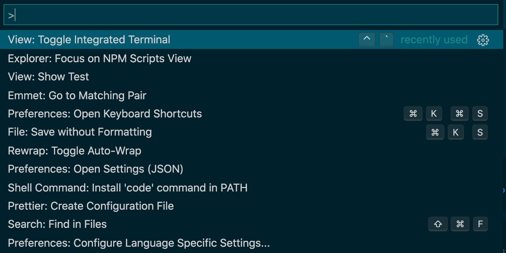
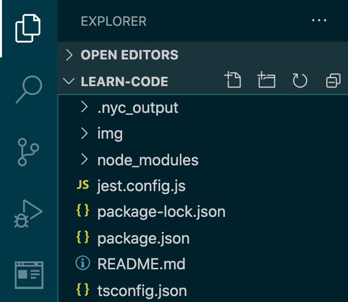
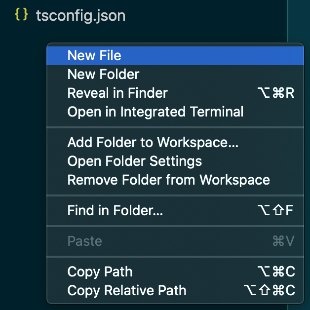
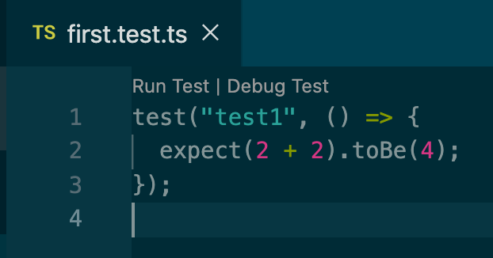
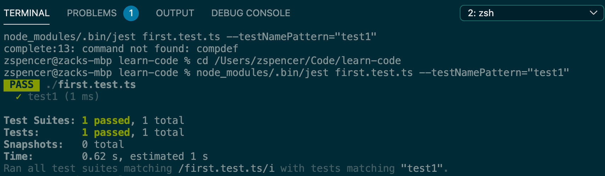
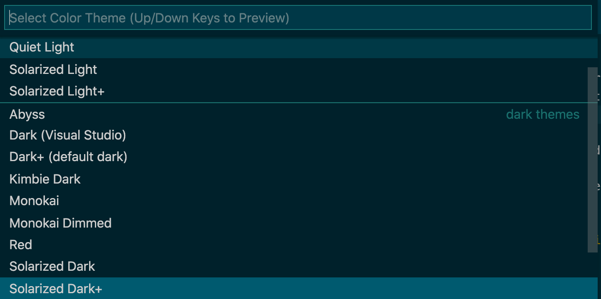

This is meant to be a minimal baseline of technology to be able to start writing
unit tests for typescript. From such a place, it is expected that one might be
able to start learning to c ode.

These instructions are currently for default mac keybindings, but it should be
possible to follow along with a different OS by finding the features of VS Code
I employ in the application menu.  Feel free to open an issue if you'd like to
see this made a bit more cross-platform.

1. Install [VS Code] and [Node.js] using the installers from their respective
   websites.

[vs code]: https://code.visualstudio.com/
[node.js]: https://nodejs.org/

2. Open a new folder in VS Code.  I called mine `learn-code` but you can use
   whatever you want.  It might be easier later if it has no spaces, though.

   

   Your VS Code probably has different colors than mine, but as they say,
   "beauty is only skin deep," and it won't affect functionality. I'll show you
   how to change this later. [^1]

3. Open the command palate with **command-shift-P**.

   

4. Type "Terminal" until "View: Toggle Integrated Terminal" appears, then
   run that command with the **return** key using the **up** and **down** 
   arrow keys to select it if necessary.

5. Copy-paste the following box into the terminal and press enter. [^2]

   ```bash
   npm init -y && npm i -D typescript jest ts-jest @types/jest && npx tsc --init && npx ts-jest config:init
   ```

   **WARNING:** In general, copy-pasting into a terminal can be very dangerous.
   Always think twice before running arbitrary commands you find online.

6. Install the [javascript test runner] extension for VS Code.  Clicking the 
   large install button on that page should prompt you to open VS Code, accept
   that and push install in VS Code as well (if needed).

[javascript test runner]: https://marketplace.visualstudio.com/items?itemName=oshri6688.javascript-test-runner

7. It's time to create your first piece of code.  Open the file explorer in the
   left sidebar by clicking the files icon at the top left or by pressing 
   **command-shift-E**.

   

8. Create a new file by right clicking in the empty area under your files and
   selecting "New File."  Name your new file `first.test.ts`. [^3]

   

9. Copy the following lines into your new file:

   ```typescript
   test("test1", () => {
     expect(2 + 2).toBe(4);
   });
   ```

10. If everything has gone right, VS Code should show "Run Test | Debug Test" 
    above your first line, like this:

    

11. Go ahead an click on "Run Test."  The terminal should appear and display
    some gibberish, followed by a summary of your test run.

    

At this point, you've now run your first lines of code!  On the one hand, this
was a lot of work to have a computer verify that 2 + 2 is 4.  However, now that
the one-time setup is done, it is much easier to write more code and run it in
the future.  A few things you can try:

* Make the expectation wrong and rerun the test, for example:

  ```typescript
  expect(2 + 2).toBe(5)
  ```

* See what other math symbols you can use, for example:

  ```typescript
  expect(16 * 16 - 6).toBe(250)
  ```

* Use decimal points (with `.toBeCloseTo()`[^4]), for example:

  ```typescript
  expect(0.1 + 0.2).toBeCloseTo(0.3);
  ```

I'm hoping to write some follow up articles to this.  There's a lot more to
learn in terms of what you can do in a program.  On top of that, there's plenty
of machinery that "just works" with this specific setup, and you may want to
explore what's going on under the hood.  Let me know what you're most curious
about and I'll work on that next.

[^1]:

    You can change the colors of VS Code using the command "Preferences: Color
    Theme" from the command palate (**command-shift-P**) and selecting the one
    best suited for you with the **up** and **down** arrow keys.  For the
    best color theme ever, though, you'll need to install the [Solarized] color
    theme from linked plugin.

    

[^2]:

    If you wanted to know what the complicated command above did a bit better,
    here's a less condensed version.  The lines which start with `#` are
    commentary and should not be typed into the terminal.

    ```bash
    # Create package.json
    npm init -y
    # Install typescript
    npm install --save-dev typescript
    # Install the jest test runner and typescript support for it
    npm install jest ts-jest @types/jest
    # Create tsconfig.json
    npx tsc --init
    # Create jest.config.js
    npx ts-jest config:init
    ```

[^3]:

    The `.ts` extension tells VS Code this is a typescript file, and the 
    `.test.ts` suffix tells Jest that this file contains tests.

[^4]:

    Note that you should use `.toBeCloseTo` with decimals because the way 
    computers understand fractional numbers loses a bit of precision, so answers
    might not be exactly what you know they should be.  Try using `.toBe`
    instead and look at the failure to see this loss of precision in action.