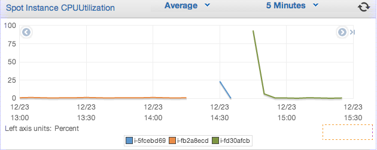

Remember [last time](/weblog/zack/2013/12/adventures-in-redundancy/) when I setup a fallback plan in case my webserver failed? Well, it didn't take long for that to happen. Twice.

The good news is that my website stayed up the whole time, thanks to the failover to S3 that I configured. I guess that's what they call testing in production. The bad news is that my webserver was running for less than 24 hours when AWS decided to kill the instance. This is perhaps a little less stability than I had expected, but I think it is still workable.

The problem here is that even when the third instance started running, it didn't have any of the configuration I had put into the first instance, so it was just sitting idle. To get the webserver running again I had to log onto the box and set it manually.

Since I had a feeling I would need to do this again, I backed up all the configuration files I needed into S3, and wrote down this set of instructions for future me [^1]:

sudo yum -y install nginx
sudo aws s3 cp s3://org.altmeta.data/spot-1/nginx.conf /etc/nginx/nginx.conf --region us-west-2
sudo aws s3 cp s3://org.altmeta.data/spot-1/ping /usr/share/nginx/html/ping --region us-west-2
sudo service nginx start

Now I could restore a server to working order at will. Unfortunately, it meant that I would need to be made aware of when this server was offline, which could take a long time. Ideally, I would have these commands be run automatically at startup, thus removing the need for manual intervention.

Enter [cloud-init](https://help.ubuntu.com/community/CloudInit). Apparently I was not the first person to have this problem, and it has a Canonical [^2] solution. When you launch an AWS instance, you are given the option to supply some arbitrary user-data. When the instance starts up, cloud-init reads that user-data and interprets it as a set of commands to execute.

I was thrilled to learn about cloud-init and how it could solve my automation problems. What followed, however, was a classic demonstration of how software development is a series of unexpected obstacles, and how a combination of research, guessing, and testing is often the only way forward.

My first attempt at my cloud-init script was to just put the above commands into my userdata. It was so simple, how could it not work? However, when my new instance launched, it was like cloud-init had never run! Files hadn't been downloaded, nginx hadn't even been installed! I tracked down the logfile for cloud-init at `/var/log/cloud-init.log`, and saw the following:

sudo: Sorry, you must have a tty to run sudo

For a moment, I despaired that cloud-init had failed me. [Initial research](http://serverfault.com/questions/324415/running-sudo-commands-in-cloud-init-script) seemed to indicate that I would need to change a file owned by `root` in order to use `sudo`. This becomes a chicken-and-egg problem, since you usually need to use `sudo` to change files owned by `root`. I was saved by [further research](http://stackoverflow.com/questions/15358830/can-i-use-cloud-init-to-install-and-configure-chef-but-not-actually-run-it), which confirmed that cloud-init is run as `root`, and therefore does not need `sudo` for anything.

I tried again with all the `sudo`s removed, and got a different error. This was great, in the sense that I had made progress. The new error was that I was unable to connect to the yum package repositories. This was easier to track down, as the [Amazon Linux FAQ](http://aws.amazon.com/amazon-linux-ami/faqs/#vpc) specifically calls out this issue. I ended up needing to give my instances a temporary IP address so they could connect to the outside world - I had accidentally configured an overzealous firewall.

After these two changes, everything worked great! My one complaint was that changing the startup script took a really long time. First I'd have to create a new spot request, then click through the UI, and finally wait some number of minutes for the instance to actually start up. I wanted something I could change a little easier.

One thing cloud-init supports is the notion of including files. This is a list of URLs to fetch and interpret as if they were additional commands in your user-data. Using this, I could pick a location within S3 as "special", and then just say to include that file. With this, I could change my cloud-init script without changing my spot instane request.

Ultimately, my user-data ended up looking like this:

#include
https://s3-us-west-2.amazonaws.com/org.altmeta.data/spot-1/startup

And [the included file](https://s3-us-west-2.amazonaws.com/org.altmeta.data/spot-1/startup) looked like this:

#!/bin/bash
yum -y install nginx
aws s3 cp s3://org.altmeta.data/spot-1/nginx.conf /etc/nginx/nginx.conf --region us-west-2
aws s3 cp s3://org.altmeta.data/spot-1/ping /usr/share/nginx/html/ping --region us-west-2
service nginx start
aws ec2 associate-address --instance-id `curl http://169.254.169.254/latest/meta-data/instance-id` --allocation-id eipalloc-f04f5b92 --region us-west-2

(That last line is to associate my public ip address with this instance, so that web traffic to altmeta.org routes to this server.)

I tested my new configuration by terminating my running instance and waiting for a new instance to take its place. Ten minutes later, a new instance had booted and was taking traffic again, with no manual intervention by me. Mission accomplished.

Since this is still a very static website, the easter egg hunt for my email address continues, should you want to share your feedback with me.

[^1]: The `aws` command here is [AWS's command line interface](http://aws.amazon.com/cli/), and the [`s3 cp` subcommand is explained here](http://docs.aws.amazon.com/cli/latest/reference/s3/cp.html). The command gets its authentication tokens from [instance metadata](http://docs.aws.amazon.com/AWSEC2/latest/UserGuide/AESDG-chapter-instancedata.html), which means I don't have to worry about how to get credentials on to the box.
[^2]: Canonical Ltd., the makers of Ubuntu linux, are the creators of cloud-init.
