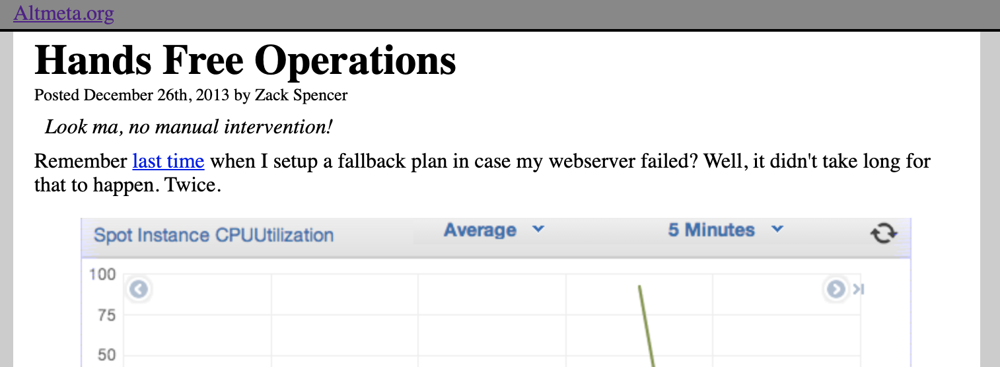
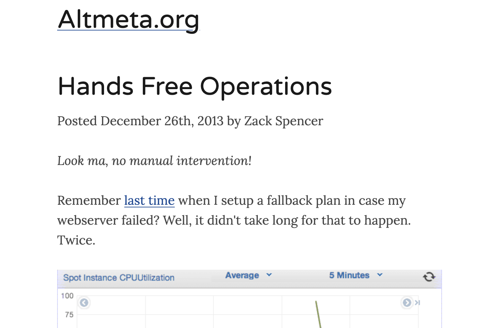
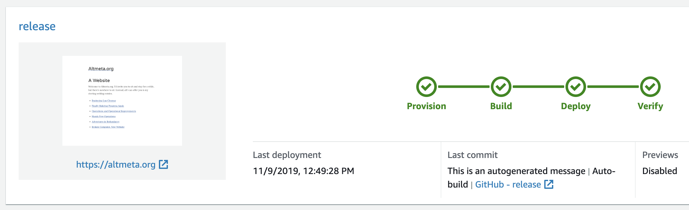

The wheel turns, and once again this website is resurrected by a bit of spare time and an interest in new technology. This time, a long overdue facelift (still not final) and a wholly new publishing system. Both of these were made possible by advances in open source and cloud-provided technologies which simply weren't available in previous updates.

As the previous version is now unavailable, here's a screenshot of what it used to look like:

And, while it's not super relevant now, the same content in the new format:

Interestingly, I spent far less time on styling the website this time than I did on the previous version. This is thanks to [Typography.js](https://kyleamathews.github.io/typography.js/), a simplified collection of out-of-the-box typesetting settings for websites. I went with the Lincoln theme without further modifications to start, and I'm pretty happy with it as-is, though we'll see if I can resist playing around with the settings a bit just because.

And I found Typography.js through the [excellent tutorials](https://www.gatsbyjs.org/tutorial/) for [Gatsby](https://www.gatsbyjs.org/), a static site building framework which represents everything I wished I could have at previous attempts to modernize this website. Without detailing every single feature I'm using, the short version is that instead of writing raw HTML with lots of duplicated layout code, I'm now writing [markdown](https://github.com/adam-p/markdown-here/wiki/Markdown-Cheatsheet) with a layout implemented in [React](https://reactjs.org/). This makes writing new pages much easier, and makes changing the layout a single-file change instead of a tedious copy/paste exercise across every post ever written.

Because Gastby is a static site framework, it can be trivially hosted by copying all build artifacts to a static site host like [GitHub pages](https://pages.github.com/) or [AWS S3 (our previous solution)](/weblog/zack/2013/12/broken-computer-new-website/). However, I decided to try out a slightly more complicated hosting solution in [AWS Amplify](https://aws.amazon.com/amplify/). It does a lot of things I don't currently care about, but what I'm using it for is continuous build-and-deploy when I push code.

What this means is that when I update code in [this poorly named github repo](https://github.com/zandaleph/bookish-carnival/tree/release), Amplify will automatically download the new version, run the build, and deploy to cloudfront (AWS's CDN), which is hosting this website. As an added bonus, it supports multiple deployments so I can be 100% sure things are working on a beta endpoint before updating the main site.

All of these technologies have been created since I last attended to this site. Typography appears to have been [largely developed in 2016](https://github.com/KyleAMathews/typography.js/graphs/code-frequency), [Gatsby got rolling in 2017](https://github.com/gatsbyjs/gatsby/graphs/code-frequency), and [Amplify was released in late 2017](https://aws.amazon.com/blogs/mobile/announcing-aws-amplify-and-the-aws-mobile-cli/). I had dreamed of using a better design, some code to generate the boilerplate on each page, and legeraging serverless frameworks to continuously deploy updates. By waiting a few years for these ideas to become mainstream, I saved myself a ton of effort. Hopefully, that saved effort will translate to a renewed appetite for generating content for this site instead. Only time will tell.
