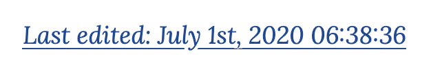
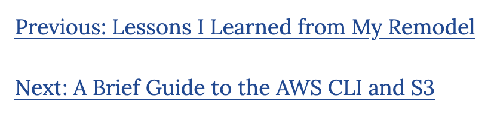
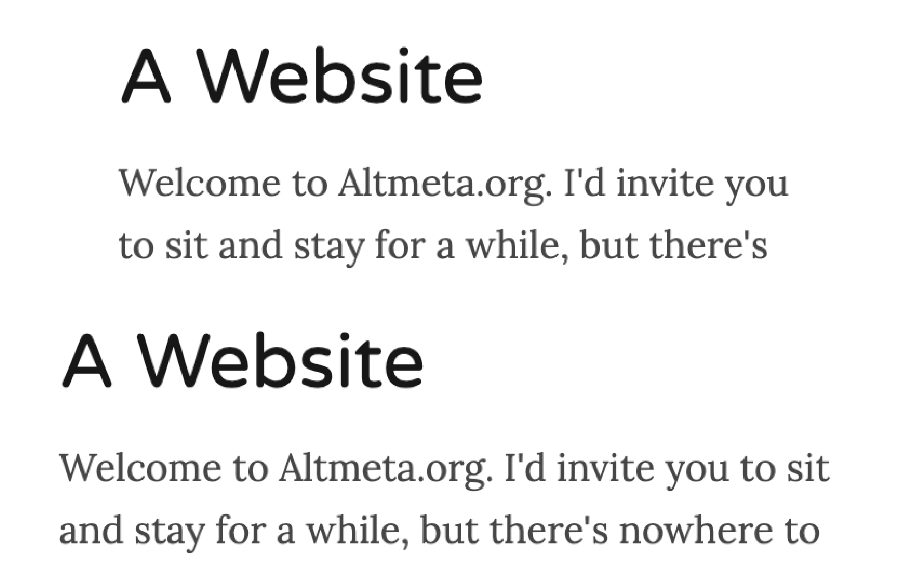

Back when I wrote [the roadmap post], I predicted that I would write "Something
about updating website template" with a few bullet points.  While it has taken
significantly longer than I'd hoped to get here, this is it.

[the roadmap post]: /weblog/zack/2020/02/where-do-we-go-from-here/

I've presented these in chronological order, but I promise I've saved the best
for last.

## [Last Edited Link]

[Last Edited Link]: https://github.com/zandaleph/bookish-carnival/commit/d930a5d5c8dbba93221f9cd6c669bf811fb9486b



The oldest minor change of this set was added a couple of weeks after the
roadmap post, and wasn't even one of the hinted changes.  However, I realized
after submitting a few changes to the documentation of some open source sites
that having direct links to the sources of articles made it easy to submit pull
requests if you had a correction to suggest.  So far, nobody has tried to send
one, but the option exists forever, now.

This feature was made pretty easy by the [`gatsby-transformer-gitinfo`] package,
which adds a few fields to the graphql nodes corresponding to files during site
building (i.e. `gatsby-node.js`).  I accessed the new data I needed to create my
link with this graphql snippet:

[`gatsby-transformer-gitinfo`]: https://www.gatsbyjs.org/packages/gatsby-transformer-gitinfo/

```
parent {
  ... on File {
    fields {
      gitLogLatestDate(formatString: "YYYY-MM-DD[T]HH:mm:ssZ")
    }
    relativePath
  }
}
```

and then the link itself was (I thought) a simple bit of date formatting and an
`<a>` tag.

A while later, I realized that while the date was showing up just fine in
Chrome, Safari was showing a bunch of NaNs where the date should be.
Safari is a little less forgiving of date formats for its `Date` object in
javascript, and the `formatString` argument above [was added to fix the issue]
almost two months later.

[was added to fix the issue]: https://github.com/zandaleph/bookish-carnival/commit/617be474282fabd41558cc36a53796964b397609

It turned out this was necessary because the `gatsby-transformer-gitinfo`
package uses an old `git-format` substitution that doesn't emit strict ISO 8601
datetime strings.  If it was updated to a newer substitution, it would have
worked perfectly.  [I created a pull request] to make this option available in a
backwards-compatible fashion, but so far it seems to be being ignored by the
package author.  I may have to find myself the proud author of a gatsby plugin
if it sits much longer.

[I created a pull request]: https://github.com/kraynel/gatsby-transformer-gitinfo/pull/17

## [Previous and Next Links]

[Previous and Next Links]: https://github.com/zandaleph/bookish-carnival/commit/9550d09bf1b22d675219d237aeb35881991edea8



After figuring out the git links, I turned my attention to the actually promised
feature - previous and next links.  Historically, I always mentioned the
previous post somehow in the text of the article, but it's nice to have a
consistent place to be able to traverse my ramblings (is it?  I assume so,
anyway).

I [watched a video] that outlined the basics of creating these links, and it
turned out to be pretty simple, but also more involved than I previously
guessed. The trick is to gather and pass enough information about the previous
and next articles during node creation, so the blog post template can simply
render them like anything else.

[watched a video]: https://egghead.io/lessons/gatsby-add-next-and-previous-links-to-a-gatsby-blog

In `gatsby-node.js` during the `createPages` lifecycle phase, here's how we add
the page context needed for previous and next links:

[here's how we add the page context needed]: https://github.com/zandaleph/bookish-carnival/commit/9550d09bf1b22d675219d237aeb35881991edea8#diff-fda05457e393bada716f508859bfc604R48-R49

```js{8-9}
const edges = result.data.allMdx.edges;
  edges.forEach(({ node }, index) => {
    createPage({
      path: node.fields.slug,
      component: path.resolve(`./src/templates/blog-post.tsx`),
      context: {
        slug: node.fields.slug,
        prev: index <= 0 ? null : edges[index - 1].node,
        next: index >= edges.length - 1 ? null : edges[index + 1].node,
      },
    });
```

Then in `blog-post.tsx`, my blog post template, I [use this helper function] to
turn the passed-in data into React elements:

[use this helper function]: https://github.com/zandaleph/bookish-carnival/commit/9550d09bf1b22d675219d237aeb35881991edea8#diff-0a1814b69a9ee4caa91d68d1e1cfce64R32-R41

```js
function relativeLink(
  rel: BlogPostNode | null,
  link: string
): JSX.Element | null {
  return rel != null ? (
    <Link to={rel.fields?.slug ?? ''}>
      {link}: {rel.frontmatter?.title}
    </Link>
  ) : null;
}
```

## [Mobile Layout Changes]

[Mobile Layout Changes]: https://github.com/zandaleph/bookish-carnival/commit/677a3d03338e7f887754d075c420f79d5b275dc5



When I setup the site, I was following a few guides at once and leaned heavily
on [Typography.js] to provide default styling for my website so I didn't get
bogged down agonizing over every pixel of padding.  I'm glad I did this.
However, one thing I began to notice was that the amount of blank space on the
sides of the text on mobile was annoyingly large.  It felt like over a third of
the screen real estate was taken up by padding.  I decided to change this.

[Typography.js]: https://kyleamathews.github.io/typography.js/

However, reducing the padding on the left and right sides meant that the content
got wider on a desktop browser, which I wasn't as keen on.  So I reduced the
`max-width` of the content to keep things largely the same.  This is a little
bit of a hack, but I generally feel almost all CSS work is hackery so I'm okay
with it.

Long term I'll probably need to use some media queries and set up truly
different layouts for mobile and desktop. For now, I'm still trying to stay out
of overdoing this and giving up progress on content.

## [Continuous Integration]

[Continuous Integration]: https://github.com/zandaleph/bookish-carnival/commit/2376ced17c7a0830e924827fa943b5bae6130620


After getting into [dependency upgrade hell] which locked me out of shipping any
of these changes for months, I started to think about how I could automate
upgrading dependencies and avoid the problem altogether.  However, to ensure
that automation doesn't break the build, I first have to automate "the build",
and be able to detect when it doesn't work as expected.

[dependency upgrade hell]: /weblog/zack/2020/05/the-unforseen-perils-of-dependency-upgrades/

This is the definition of Continuous Integration, a now-ubiquitous practice in
software development wherein any time any change is made, the end product is
automatically produced and any errors in that production or tests of the product
are used as a signal to determine if the change is good or bad.  Put more
simply, each commit gets automatically tested to ensure it isn't broken.

This practice has been so popular because it enforces something teams previously
had to ensure by rote - that the central repository of code is always a
buildable, sane starting place for new changes.  With continuous integration,
you can automate testing this is the case on every new commit, and only let them
into the shared branch if they follow this simple rule.

Now, this is only as good as your tests, and it's still very possible for broken
code to make it into the shared branch if the brokenness isn't covered by
existing tests (this is why we still have plenty of bugs in software).  But,
something is better than nothing, and that's what I've adopted for this website.

It turns out that, absolutely free of charge, [GitHub Actions] will run
**arbitrary code** on each commit and pull request (and [many other events]).
They even have a straightforward UI to get you started, complete with [excellent
documentation on how to implement CI] with actions.  I am still blown away by
the possibilities of this feature, and can't believe people don't talk about it
more.

[GitHub Actions]: https://docs.github.com/en/actions
[many other events]: https://docs.github.com/en/actions/reference/events-that-trigger-workflows
[excellent documentation on how to implement CI]: https://docs.github.com/en/actions/building-and-testing-code-with-continuous-integration/setting-up-continuous-integration-using-github-actions

My [CI script] is almost as simple as they come:

[CI script]: https://github.com/zandaleph/bookish-carnival/commit/2376ced17c7a0830e924827fa943b5bae6130620#diff-e9f950f17198d3d5e3122a44230a09b9R25-R32

```yaml
- name: Install
  run: yarn install

- name: Stub aws-exports
  run: echo "export default {};" > src/aws-exports.js

- name: Build
  run: yarn build
```

The one wrinkle, that "Stub aws-exports" step, is more of a hack around bad code
that I haven't cleaned up yet than a necessary thing.  One day, I hope I kill
it. Or, I hope I learn how to use managed secrets so I can put a real value
there.

## [Using Renovate]

[Using Renovate]: https://github.com/zandaleph/bookish-carnival/commit/eb6a44db7b0598d2c3185a943da7f9679913f4ec

I discovered [Renovate] while working on the last edited link.  The only other
pull requests for the [gatsby-transformer-gitinfo] package were from some bot
trying to keep dependencies up to date, and I thought to myself "that's neat".
Little did I know the trouble I'd be in shortly thereafter for not keeping my
own dependencies up to date.

[Renovate]: https://renovate.whitesourcesoftware.com/

Renovate is a free service for GitHub hosted repositories which will keep your
project's dependencies up to date.  By default, it will open pull requests for
each change it wants to make, giving you control over what you're comfortable
with changing and not.  However, you can also configure it to automatically
merge certain classes of change if they pass your continuous integration
automation. Actually, you can configure [a lot more than that] but I decided to
keep it simple for now.

[a lot more than that]: https://docs.renovatebot.com/configuration-options/

The one change I did make to the default configuration for renovate was to allow
it to [auto-merge minor version updates] if they passed my continuous
integration. In [the original setup pull request], I was informed that I'd have
20 pull requests to merge. I decided that that was more effort than I was
willing to put forth to stay up to date, so accepting auto-merging of minor
version updates was an easy thing to accept.

[auto-merge minor version updates]: https://docs.renovatebot.com/presets-default/#automergeminor
[the original setup pull request]: https://github.com/zandaleph/bookish-carnival/pull/5

There are still a [couple] of [packages] that, for some reason, break the build
when upgraded.  When I run the build locally, they work fine, so I still have
some work to do to understand the difference between GitHub's build environment
and my own.  But, that's a minor follow up - in general this has been seamless,
and I get a couple emails a day letting me know that the automation is happily
keeping things up to date.  Now to figure out how to filter those emails down to
just the broken builds...

[couple]: https://github.com/zandaleph/bookish-carnival/pull/9
[packages]: https://github.com/zandaleph/bookish-carnival/pull/28